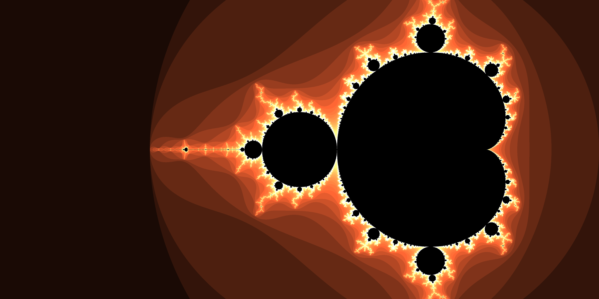

## Mandelbrot Set Image Generator

- generateMandelbrot.js - Generates data to a variable in ram, originally the only version of the code.
- generateMandelbrotColorsToMemory.js - Generates image color data to json files which can be used by the program to regenerate images at a later time.
- generateMandelbrotValuesToMemory.js - Stores values at which points of the complex plane escape the Mandelbrot set, which can be used to generate new color pallets via editing of the maximum values in the inverseLerp function calls in function rgbConv.js in file `./modules/functions`. 

### Information

- Files are documented to a valid extent and attemptedly understandable.
- Files in ./modules are various functions which are used by the generation files to generate the color values.
- Directories ./stored-values and ./images are to be used for the storage of data and image files. Deletion of these directories may cause issues in code.

### Demonstration

### Notes / TODO

- Please create an [issue](https://github.com/Broken-Admin/mandelbrot-set/issues/new) if you have any ideas or recommended features.